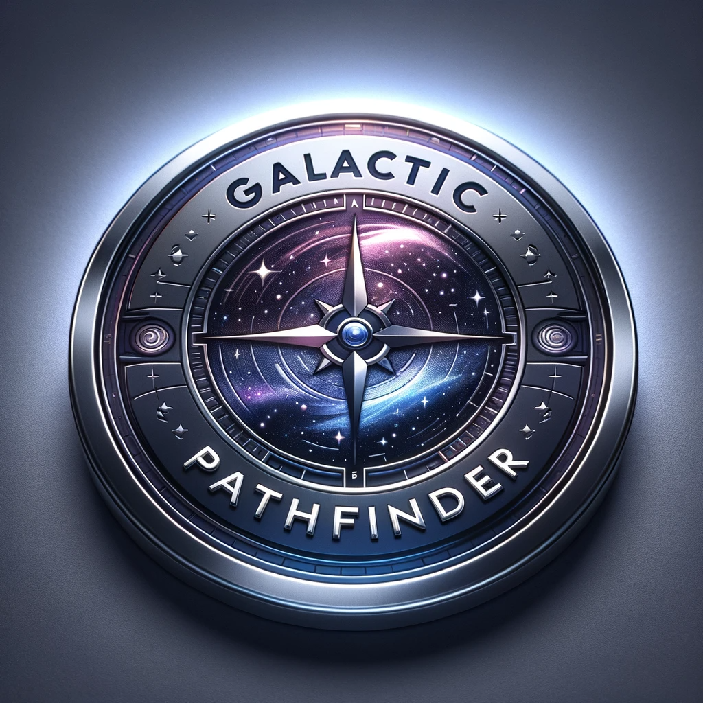

# GalacticPathFinder

GalacticPathFinder is an interactive web application designed to visualize and understand the A\* pathfinding and other pathfinding algorithms. It allows users to create grids, set start and end points, visualize the algorithm's step-by-step process, and experiment with different heuristics. This tool is ideal for students, educators, and anyone interested in algorithm visualization and AI pathfinding techniques. It is made with Django backend and React Typescript frontend.

## Features:

- [ ] **Create Grids/Graphs:** Users can generate grids or graphs on which the A\* algorithm operates.
- [ ] **Set Start and End Points:** Flexibility to define start and end points to visualize pathfinding.
- [ ] **Visualize Algorithm:** Step-by-step visualization of the A\* algorithm in action.
- [ ] **Customize Heuristics:** Experiment with different heuristics to see how they influence the pathfinding process.
- [ ] **Web Deployment:** Accessible on the World Wide Web for widespread use and demonstration.

## Setup

## Usage

## Contributors

<table align="center">
  <tr>
    <td align="center">
        <a href="https://github.com/Spiderpig02">
             
            <b>Daniel Neukirch Hansen</b>
        </a>
    </td>
    <td align="center">
        <a href="https://github.com/Jensern1">
             
            <b>Jens Martin Norheim Berget</b>
        </a>
    </td>
    <td align="center">
        <a href="https://github.com/SverreNystad">
             
            <b>Sverre Nystad</b>
        </a>
    </td>
  </tr>
</table>
